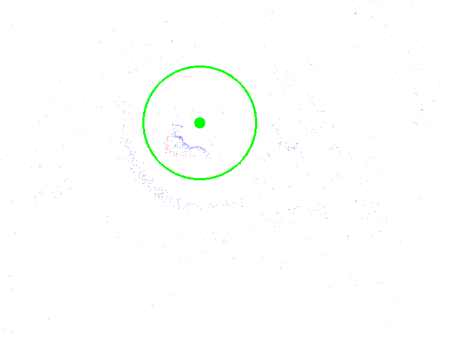
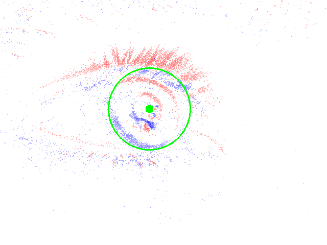
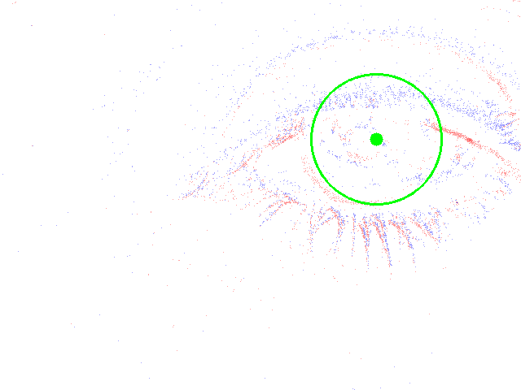

# Event-based Eye Tracking Challenge--solution
This is the code for the first place on the private leaderboard of the Event-based Eye Tracking AI for Streaming CVPR 2024 Challenge. [**[Leaderboard]**](https://www.kaggle.com/competitions/event-based-eye-tracking-ais2024/leaderboard) [**[Official Page]**](https://eetchallenge.github.io/EET.github.io/)

## Requirements
The lines below should set up a fresh environment with everything you need:
```python
conda create --name eye_tracking
conda activate eye_tracking
conda install pytorch==1.11.0 torchvision==0.12.0 torchaudio==0.11.0 cudatoolkit=11.3 -c pytorch
pip install -r requirements.txt
```

## Test
We provide two pre-trained [**models**](https://drive.google.com/drive/folders/18LC4IyezDinmEY8MwDWRepbQ2y-qzitj?usp=drive_link) , differing only in the training data. One is trained on the training set. The other is trained on both the training and validation sets together. The two models have the same p_10 accuracy, but there may be differences in p_error.


Set the paths of 'checkpoint' in test.sh, then run this:

```python
./test.sh
```
This will create a submission.csv file in the log folder where the program is located. The CSV files generated by two models have the same accuracy, which is 0.9925 on the public test set and 0.9958 on the private test set. 

If you want to obtain the results for our final submission on Kaggle, using the model trained on both the training and validation sets, change test_length and test_stride to 45 and 10, respectively, and then execute the above command.

**Attention: 
Some of my experiments were conducted using 3080ti or 3090, with Torch version 2.1.0 and CUDA 11.8, resulting in slight differences in inference results compared to Torch 1.11.0 and CUDA 11.3. From observation, these differences may affect up to the third decimal place, but have no impact on the final scores.**

## Visualize
Set the paths for ‘data_dir‘ and ‘submission_file‘ in the visualize.py file, then run this.
```python
python visualize.py
```
This will create a folder prefixed with "vis_event", containing visualization results for the test set. Green dots represent predicted values, and circles represent a range of 10 pixels.

|   |   |
| ------------------------------ | ------------------------------ |
|  |  |


## Performance
| Method                                                                                    | GPU            | Averaged Distance  | P10 Accuracy on private leaderboard      |  Inference Latency (bs=1)    | 
|-------------------------------------------------------------------------------------------|----------------|----------|------------------|----------|
|CNN_GRU_Mamba | RTX 1080ti 11 Gb | \    | 0.9958  |  1.956ms  |

## train
run this:
```python
./train.sh
```
The meanings of the parameters are to be added.
